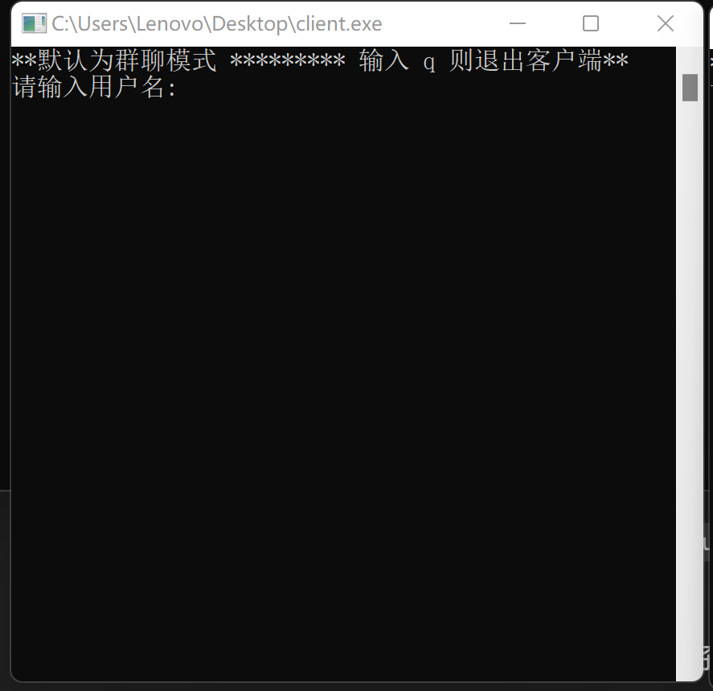
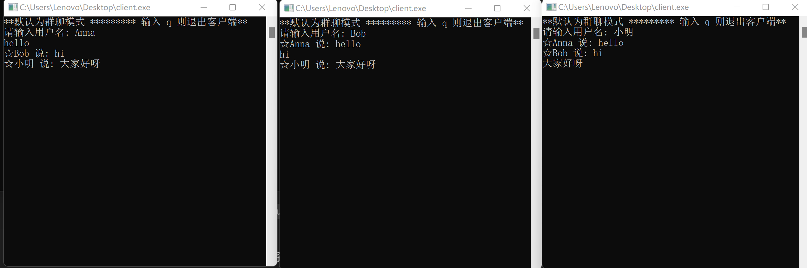
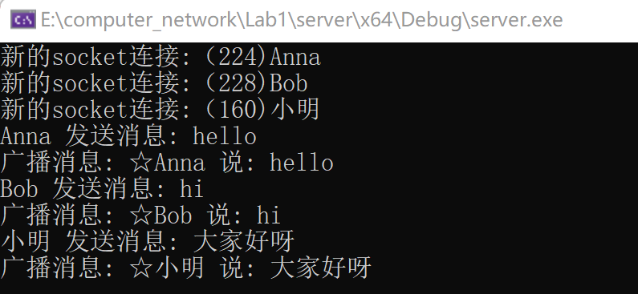
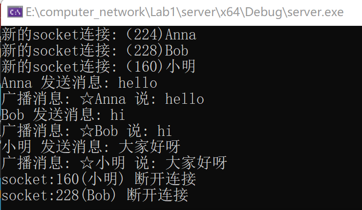

# 实验报告：基于Socket的多人聊天程序
姓名：刘玉菡
专业：物联网工程
学号：2213244

## 一、概述

### （一）主要特性
1. 多线程流式服务端：
   - 服务端使用流式Socket（TCP）进行通信，支持多个客户端同时连接。每个连接由独立的线程处理，保证并发性和性能。
   
2. 群聊：
   - 每个客户端对应唯一用户姓名
   - 多客户端并发交流
   

### （二）环境
- 操作系统：Windows 11
- 编程语言：C++
- 编译器：Visual Studio2022
- Socket库：Windows Sockets API（WinSock2）

## 二、协议设计

### （一）不同类型消息的基本结构
1. 群聊消息：直接发送文本消息，服务器会将其广播给所有连接的客户端。
2. 控制命令：客户端发送的控制命令，用于切换模式或退出聊天。命令由特定字符串触发。

### （二）操作消息

1. `group`（默认）：进入群聊模式。该命令用于明确告知客户端当前处于群聊状态（默认为群聊模式）。
   - 命令示例：`group`
   - 响应：切换到群聊模式，接下来所有消息都将广播到聊天室。

2. `q`：客户端退出。
   - 命令示例：`q`
   - 响应：客户端关闭Socket连接并退出程序，服务器检测到连接断开。

3. `private`（后续将完善功能）：进入私聊模式。该命令用于明确告知客户端当前处于私聊状态，后续提示输入目的用户。
   - 命令示例：`private`
   - 响应：切换到私聊模式，接下来所有消息将通过服务端发送给指定用户。

## 三、程序流程

1. 服务端启动：服务端通过流式Socket在指定端口监听客户端连接请求。
2. 客户端连接：客户端通过Socket连接到服务端，输入用户名并加入聊天室。
3. 消息发送与接收：
   - 群聊模式：客户端输入消息后，服务器接收并将消息广播给所有连接的客户端。
   - 退出：客户端输入 `q` 后，断开连接并正常退出。
4. 服务器处理：服务端通过多线程处理每个客户端的连接，接收消息后通过广播机制转发给其他客户端。
5. 客户端接收消息：客户端启动一个接收线程，不断监听来自服务器的消息并在终端显示。

## 四、程序设计
### 服务端日志揭露格式说明
   · <username>发送消息：<content> //接收
   · 广播消息：☆<username>说：<content> //发送


### （一）基本通信及消息解析
本程序中的通信交互主要通过阻塞的send()和recv()实现
1. socket 创建与初始化
   · 服务端：
   - socket()：创建服务器的流式Socket（TCP）。
   - bind()：绑定服务器的Socket到指定的IP和端口（0.0.0.0 表示接受所有IP的连接）。
   - listen()：使服务器的Socket进入监听模式，等待客户端的连接。
   - accept()：接受客户端连接，当有客户端发起连接请求时，会返回一个新的Socket用于与该客户端进行通信。

```
	//1、创建socket套接字
	SOCKET listen_socket = socket(AF_INET, SOCK_STREAM, 0);
	if (INVALID_SOCKET == listen_socket) {
		cout << "listen_socket创建失败！！！" << " " << GetLastError() << endl;
		return -1;
	}

	//2、给这个socket绑定一个端口号
	struct sockaddr_in local = { 0 };
	local.sin_family = AF_INET;
	local.sin_port = htons(8080);//大小端的问题 中间设备使用的是大端序（路由器）
	//local.sin_addr.s_addr = htonl(INADDR_ANY); //服务端 选项 网卡127.0.0.1（本地环回）只接受哪个网卡的数据 一般写全0地址表示全部都接受
	local.sin_addr.s_addr = inet_addr("0.0.0.0"); //字符串IP地址转换 成整数IP地址

	//int bind(int sockfd, const struct sockaddr addr,socklen_t addrlen);
	if (-1 == bind(listen_socket, (struct sockaddr)&local, sizeof(local)))
	{
		cout << "绑定socket失败！！错误：" << GetLastError() << endl;
		return -1;
	}


	//3、给这个socket开启监听属性
	if (-1 == listen(listen_socket, 10))
	{
		cout << "启动监听socket失败！！错误：" << GetLastError() << endl;
		return -1;
	}
    //4、等待客户端连接
	//返回的客户端socket才是跟客户端可以通讯的一个socket
	//阻塞函数，等到有客户端连接进来就接受连接，然后返回，否则就阻塞
	SOCKET client_socket = accept(listen_socket, NULL, NULL);
```
· 客户端
   - connect()：客户端使用这个函数连接到服务器的指定IP和端口。
```
//1、创建socket套接字
	SOCKET  client_socket = socket(AF_INET, SOCK_STREAM, 0);
	if (INVALID_SOCKET == client_socket)
	{
		cout << "创建socket失败！！" << endl;
		return -1;
	}


	//2、连接服务器
	struct sockaddr_in target;
	target.sin_family = AF_INET;
	target.sin_port = htons(8080);
	target.sin_addr.s_addr = inet_addr("127.0.0.1");

	if (-1 == connect(client_socket, (struct sockaddr)&target, sizeof(target)))
	{
		cout << "连接服务失败！！1" << endl;
		closesocket(client_socket);
		return -1;
	}
```

2. 消息的发送与接收
· 服务端
   - recv()：服务器使用 recv() 函数接收来自客户端的消息。消息的大小最多为1024字节，接收到后，服务器根据消息内容进行处理。
   - broadcast_message()：如果消息不是私聊消息，服务器会调用 broadcast_message() 将消息广播给所有客户端。
   - private_message()：如果消息是以 @ 开头，表示私聊消息，服务器会调用 private_message() 将消息转发给目标用户。
```
   DWORD thread_func(LPVOID lpThreadParameter)
{
	ClientInfo client_info = (ClientInfo)lpThreadParameter;
	SOCKET client_socket = client_info->client_socket;
	string username = client_info->username;

	while (1) {
		char buffer[1024] = { 0 };
		int ret = recv(client_socket, buffer, 1024, 0);
		if (ret <= 0) break;  // 如果接收失败或客户端断开连接

		buffer[ret] = '\0';  // 确保字符串以 '\0' 结尾

		string msg(buffer);
		cout << username << " 发送消息: " << msg << endl;

		// 广播消息给所有客户端，跳过发送者
		//broadcast_message(msg, username, client_socket);  // 传入发送者的 socket

		if (msg.find("@") == 0) {  // 私聊消息的处理逻辑
			size_t space_pos = msg.find(' ');
			if (space_pos == string::npos) {
				cout << "私聊消息格式错误" << endl;
				continue;  // 如果格式不正确，跳过本次处理
			}

			string target_name = msg.substr(1, space_pos - 1);  // 提取目标用户名
			string private_msg = msg.substr(space_pos + 1);  // 提取私聊消息内容
			cout << "目标用户: " << target_name << ", 消息内容: " << private_msg << endl;

			// 发送私聊消息
			private_message(private_msg, target_name, username);
		}
		else {
			// 群聊消息处理
			broadcast_message(msg, username, client_socket);
		}
	}

	cout << "socket:" << client_socket <<"("<<username<<")" << " 断开连接" << endl;

	// 客户端断开连接时从列表中移除
	{
		lock_guard<mutex> guard(clients_mutex);
		clients.erase(remove_if(clients.begin(), clients.end(),
			[&](const ClientInfo& client) { return client.client_socket == client_socket; }),
			clients.end());
	}

	// 关闭连接
	closesocket(client_socket);
	return 0;
}
```

· 客户端
   - send()：客户端使用 send() 将消息发送给服务器。在群聊模式下，消息直接发送；在私聊模式下，消息以 ☆<目标用户名> <消息> 的格式发送。
   - recv_func()：客户端通过 recv_func() 函数不断监听服务器转发的群聊消息或私聊消息，并在客户端显示。
```
// 接收服务器消息的函数
void recv_func(SOCKET client_socket)
{
	while (1) {
		char rbuffer[1024] = { 0 };
		int ret = recv(client_socket, rbuffer, 1024, 0);
		if (ret == SOCKET_ERROR) {
			cout << "接收消息失败，错误码: " << WSAGetLastError() << endl;
			break;
		}
		if (ret <= 0) {
			cout << "服务器断开连接" << endl;
			break;
		}
		rbuffer[ret] = '\0';  // 确保字符串结尾
		cout << rbuffer << endl;
	}
}
```
```
while (1) {
		string input;
		getline(cin, input);

		if (input == "q") {
			cout << "客户端正在退出..." << endl;
			closesocket(client_socket);  // 关闭客户端socket
			break;  // 退出循环，结束程序
		}

		if (input == "group") {
			current_mode = "group";
			cout << "切换到群聊模式" << endl;
		}
		else if (input.find("private") == 0) {
			if (input.length() <= 8) {
				cout << "请输入私聊目标用户名" << endl;
				continue;  // 如果没有提供用户名，则提示并跳过
			}

			target_name = input.substr(8);  // 获取目标用户名
			current_mode = "private";
			cout << "切换到私聊模式，目标用户: " << target_name << endl;
		}
		else {
			// 根据模式发送消息
			if (current_mode == "group") {
				send(client_socket, input.c_str(), input.size() + 1, 0);  // 确保包含字符串结束符 '\0'
				//cout << "发送群聊消息: " << input << endl;  // 添加调试输出
			}
			else if (current_mode == "private") {
				string msg = "@" + target_name + " " + input;
				send(client_socket, msg.c_str(), msg.size() + 1, 0);  // 确保包含字符串结束符 '\0'
				cout << "发送私聊消息: " << msg << endl;  // 添加调试输出
			}
		}
	}
```

### （二）多线程
每当有客户端连接时，服务器都会创建一个新的线程处理该客户端的消息收发。
   - CreateThread()：服务器每接收到一个新的客户端连接后，会调用 CreateThread() 创建一个新的线程，为该客户端处理通信逻辑。
```//server
while (1)
{
    SOCKET client_socket = accept(listen_socket, NULL, NULL);
    if (INVALID_SOCKET == client_socket) continue;

    // 获取用户名
    char name_buffer[1024] = { 0 };
    recv(client_socket, name_buffer, 1024, 0);
    string username(name_buffer);

    ClientInfo client_info = new ClientInfo{ client_socket, username };

    // 创建线程处理该客户端
    CreateThread(NULL, 0, thread_func, client_info, 0, NULL);
}

```

### （三）用户信息
存储和管理所有连接到服务器的客户端信息。
  - ClientInfo 结构体包含了每个客户端的Socket和用户名。
  - 使用了 list<ClientInfo> 来保存客户端的信息。
  - 为了确保多个线程操作 clients 列表时不会发生数据竞争，使用了互斥锁（mutex）。在访问或修改 clients 列表时，程序会加锁，确保线程安全。
  - find_client_by_name() 函数：通过传入的用户名来查找对应的客户端Socket。
```//server
// 保存客户端信息（ID 和 SOCKET）
struct ClientInfo {
	SOCKET client_socket;
	//int client_id;
	string username; // 可选，假设每个客户端有一个用户名
};

list<ClientInfo> clients;
mutex clients_mutex;

// 通过用户名查找客户端
SOCKET find_client_by_name(const string& username) {
	lock_guard<mutex> guard(clients_mutex);
	for (const auto& client : clients) {
		if (client.username == username) {
			return client.client_socket;
		}
	}
	return INVALID_SOCKET;
}
```

## 五、程序实现
1. 客户端初始界面：系统提示“默认为群聊模式，输入q则退出客户端”



2. 多人聊天窗口
   Anna，Bob和小明依次进入聊天室，他们依次发送“hello”，“hi”，“大家好呀”，他人发送的内容依次显示在自己的聊天框中（例如Anna先说“hello”，Bob和小明的聊天框中就出现了“☆Anna 说：hello”）



3. 服务端日志
   当有用户输入名称进入聊天室后，服务端记录“新的socket连接：（用户socket）<用户姓名>；
   当有用户发送消息后，服务端记录接收 “<用户姓名>发送消息：<发送内容>”，
   再把用户刚刚发送的消息转发给除该用户外的所有其他用户，记录 “广播消息：☆<用户姓名>说：<发送内容>”



4. 当由用户退出聊天室，服务端记录“socket：<用户socket>(<用户姓名>)断开连接”



## 总结

本实验使用C++和Socket API，实现了一个支持多人群聊的聊天室程序。程序能够处理基本的群聊需求，支持中文和英文的消息传输。通过多线程的设计，服务器能够同时处理多个客户端的连接，提升了程序的并发性能。